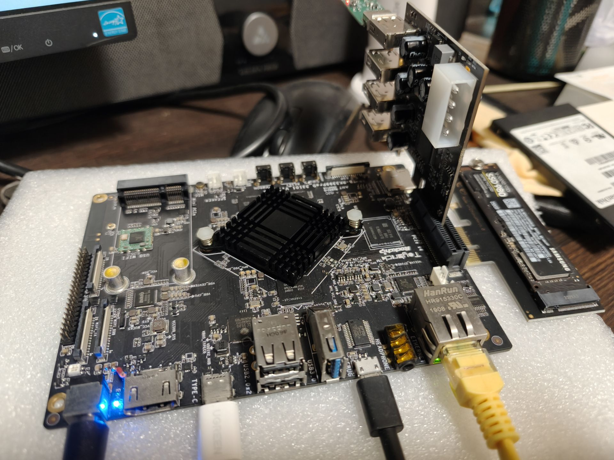
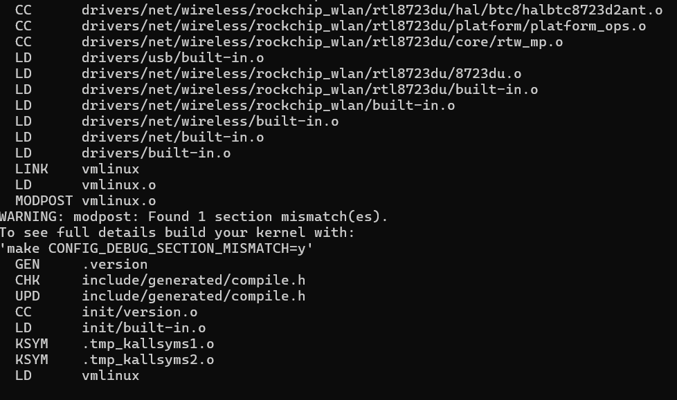
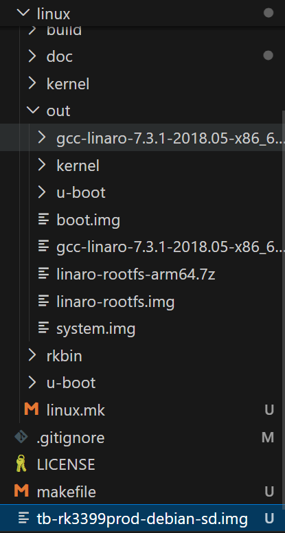
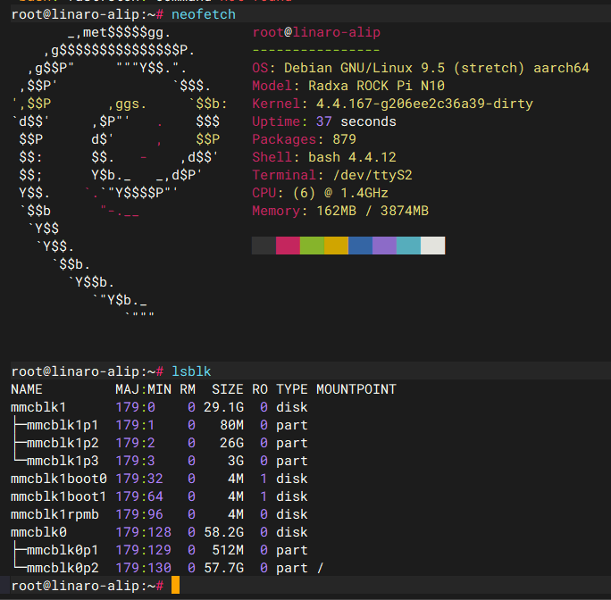
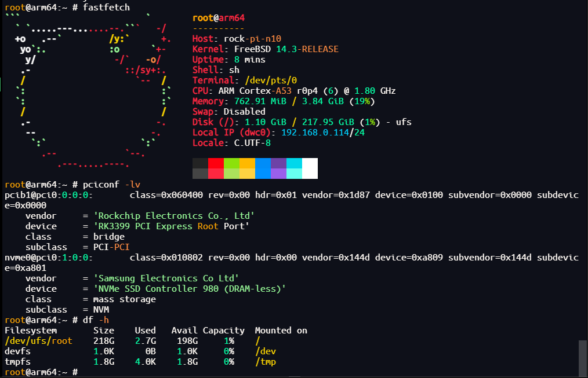
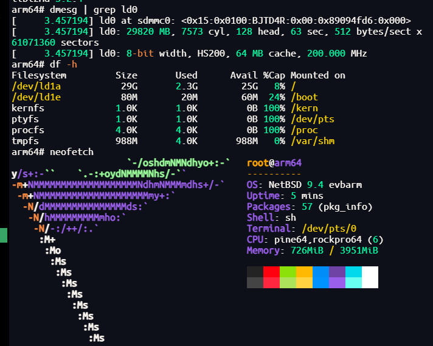

# Rock BSD Builder

- 本项目提供了一个在 RK3399 平台上交叉编译构建 Linux/FreeBSD/NetBSD 镜像的脚本工具



> 支持 Ubuntu 20.04 AMD64, Debian12 AMD64, Debian13 AMD64
> 构建前需要确保当前网络环境足够科学

- 构建 Debian-10，目前支持 Toybrick-RK3399ProD

```
make rock_linux_depends
make rock_linux_all
```







- 烧录[Rock Pi N10 固件](https://dl.sd-card-images.johang.se/boots/2025-12-01/boot-rock_pi_n10.bin.gz) 到 SD 或 eMMC 中，编译下面的 FreeBSD/NetBSD 镜像，烧录到另一个介质或者 NVMe 盘
- 构建 FreeBSD 14.3，通用镜像

```
make freebsd_tool_depends
make freebsd_all
```

- 启动后参考[setup-freebsd](./bsd/doc/setup-freebsd.md)进行设置



- 构建 NetBSD 10，通用镜像

```
make netbsd_all
```

- 启动后参考[setup-netbsd](./bsd/doc/setup-netbsd.md)进行设置

