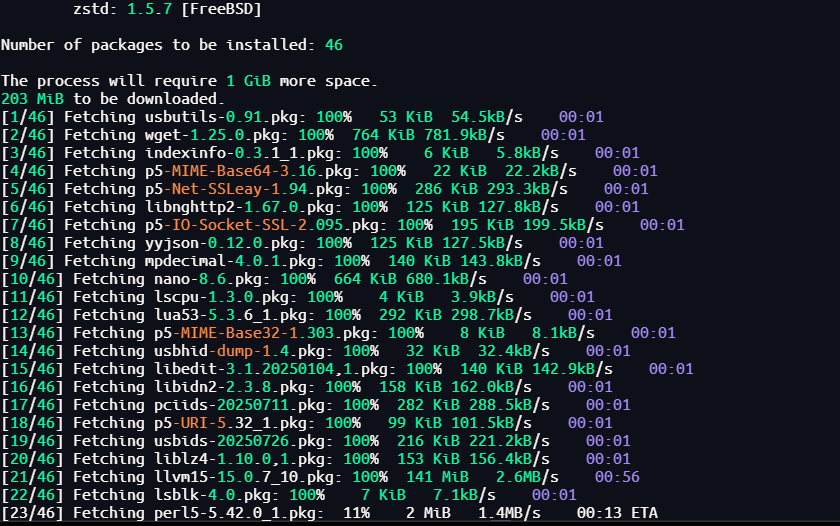
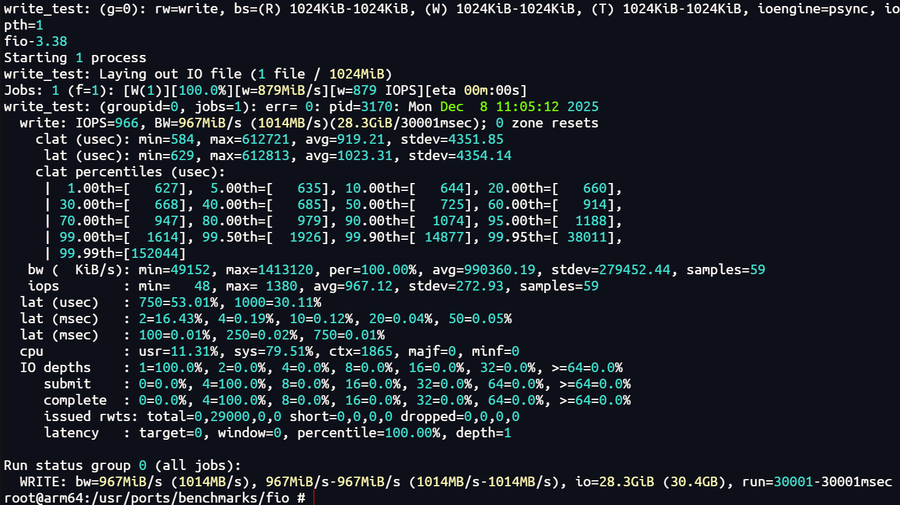
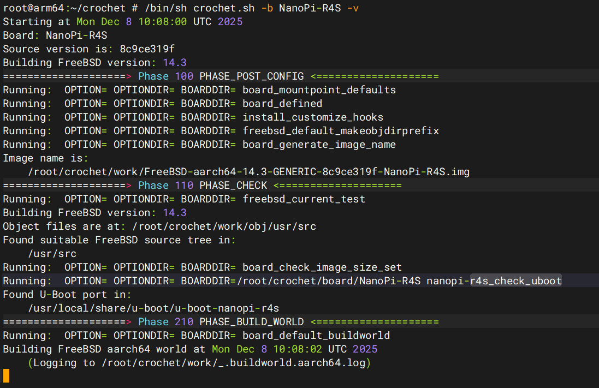

## 从 U-BOOT 启动系统

- 启动 RK3399

```
run bootcmd_nvme
```

- 启动 Firefly PI

```
fatload nvme 0:1 0x90100000 /efi/boot/bootaa64.efi;
fatload nvme 0:1 0xa0000000 /efi/boot/firefly_dsk_v2.dtb;
bootefi 0x90100000 0xa0000000
```

- 设置固定 IP （如果需要的话）

```
ifconfig xmac0 10.31.94.219 netmask 255.255.255.0
route add default 10.31.94.254
echo 'nameserver 10.22.0.16' >> /etc/resolv.conf
echo 'nameserver 10.22.0.165' >> /etc/resolv.conf
echo 'nameserver 114.114.114.114' >> /etc/resolv.conf
```

## SSH 连接

- 允许 root 登录

```
vi /etc/ssh/sshd_config
# 允许 root 登录
PermitRootLogin yes
```

- 设置密码
```
passwd
```

- 重启 SSH
```
service sshd restart
```

## 扩容 rootfs

```
service growfs onestart
```

## 配置交换分区

- 默认没有配置 swap 分区
- 创建交换文件（以 2GB 为例），启用交换文件

```
dd if=/dev/zero of=/swapfile bs=1M count=4096
chmod 600 /swapfile
mdconfig -a -t vnode -f /swapfile -u 0 && swapon /dev/md0
swapinfo
```

- 配置开机自动挂载，编辑 /etc/fstab，添加以下行

```
md99    none    swap    sw,file=/swapfile,late  0       0
```

## 安装软件

- 连接局域网的代理服务

```
export http_proxy="http://192.168.00.129:7890"
export https_proxy="http://192.168.00.129:7890"

export http_proxy="http://10.31.94.103:7890"
export https_proxy="http://10.31.94.103:7890"
```

- 更新软件源，安装软件

```
pkg update -f
pkg install -y fastfetch nano llvm git python3 usbutils pciutils lscpu lsblk wget
```

- 环境变量写入 ~/.shrc
```
nano ~/.shrc

# LLVM 工具的路径按照实际情况设置
export PATH=/usr/local/bin:$PATH
export CC=/usr/local/bin/clang
export CXX=/usr/local/bin/clang++
export LD=/usr/local/bin/ld.lld
export CPP=/usr/local/bin/clang-cpp
export HOSTCC=/usr/local/bin/clang
export HOSTCXX=/usr/local/bin/clang++
export LLVM_CONFIG=/usr/local/bin/llvm-config
```

- 检查环境变量
```
. ~/.shrc
echo "CC: $CC"
echo "CXX: $CXX"
echo "LD: $LD"
echo "CPP: $CPP"
echo "HOSTCC: $HOSTCC"
echo "HOSTCXX: $HOSTCXX"
echo "LLVM_CONFIG: $LLVM_CONFIG"
```



## 设置显示桌面

> TODO

## 本地构建替换内核

- 系统启动并联网后，可以尝试在 FreeBSD 本地编译内核进行开发

```
cd /usr/src
git init
git remote add origin https://github.com/freebsd/freebsd-src.git
git fetch --depth 1 origin release/14.3.0
git checkout FETCH_HEAD
```

- 编译内核

```
cd /usr/src
make buildkernel KERNCONF=GENERIC -j4
```

- 编译用户态

```
make buildworld -j4
```

- 编译具体的 ko 文件，如设备树 dtb 和 rtw89 驱动

```
# 编译设备树
cd /usr/src/sys/modules/dtb/rockchip
make -j4
make install
ls -lh /boot/dtb

# 编译 ko 模块
cd /usr/src/sys/modules/rtw89
make -j4
make install
ls -lh /boot/modules/if_rtw89.ko
```

- 如果需要的话可以编译 EFI 启动器

```
cd /usr/src/stand
make clean
make
mkdir -p /usr/output
make DESTDIR=/usr/output install
```

- 安装系统内核然后重启

```
vi /boot/loader.conf
# 添加下面的配置
kernel="kernel GENERIC"

# 安装用户态，一般是不需要的
make installworld

ls -l /boot/kernel/kernel*
make installkernel KERNCONF=GENERIC
ls -l /boot/kernel/kernel*
sync
poweroff
```

- 启动完成后可以查看信息变化

```
uname -a
```


## 本地构建应用程序

- 参考[FreeBSD Ports and Packages: What you need to know](https://freebsdfoundation.org/blog/freebsd-ports-and-packages-what-you-need-to-know/)

- 下载 FreeBSD ports

```
mkdir -p /usr/ports
cd /usr/ports
git init .
git remote add origin https://github.com/freebsd/freebsd-ports.git
git fetch --depth 1 origin release/14.3.0
git checkout FETCH_HEAD
```

- 配置特定的应用程序 ports，以 fio 为例

```
cd /usr/ports/benchmarks/fio/
make config
make package
```

- 编译完成后可以直接使用刚刚编译出来的 fio 了

```
ls /usr/ports/benchmarks/fio/work/pkg
pkg add /usr/ports/benchmarks/fio/work/pkg/fio-<version>.txz

fio --version

# 测试顺序写性能
fio --name=write_test --filename=/tmp/fio_write_test.bin \
    --rw=write --bs=1M --size=1G --numjobs=1 \
    --iodepth=1 --runtime=30 --time_based \
    --group_reporting --direct=1
# 测试随机写性能
fio --name=randwrite_test --filename=/tmp/fio_randwrite_test.bin \
    --rw=randwrite --bs=4k --size=1G --numjobs=1 \
    --iodepth=1 --runtime=30 --time_based \
    --group_reporting --direct=1

# 测试顺序读性能
dd if=/dev/zero of=/tmp/fio_read_test.bin bs=1M count=1024
fio --name=read_test --filename=/tmp/fio_read_test.bin \
    --rw=read --bs=1M --size=1G --numjobs=1 \
    --iodepth=1 --runtime=30 --time_based \
    --group_reporting --direct=1

# 测试随机读性能
fio --name=randread_test --filename=/tmp/fio_read_test.bin \
    --rw=randread --bs=4k --size=1G --numjobs=1 \
    --iodepth=1 --runtime=30 --time_based \
    --group_reporting --direct=1

# 测试混合读写性能
fio --name=mixed_test --filename=/tmp/fio_mixed_test.bin \
    --rw=randrw --rwmixread=70 --bs=4k --size=1G \
    --numjobs=1 --iodepth=1 --runtime=30 --time_based \
    --group_reporting --direct=1

# 测试多线程顺序写
fio --name=write_mt --filename=/tmp/fio_write_mt.bin \
    --rw=write --bs=1M --size=512M --numjobs=4 \
    --iodepth=1 --runtime=30 --time_based \
    --group_reporting --direct=1
```



## 使用 crochet 构建镜像

> 使用 root 用户进行编译，编译前确保 freebsd 源码下载到 /usr/src 目录下
```
git clone https://github.com/freebsd/crochet.git
cd crochet
pkg install u-boot-nanopi-r4s
export IMAGE_SIZE=4096
/bin/sh crochet.sh -b NanoPi-R4S -v
```


